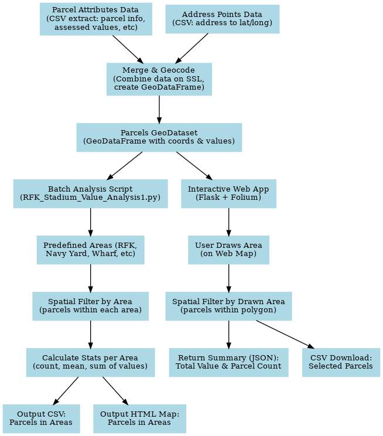

# DC Property Tax Analysis

## Project Overview
This repository provides tools to analyze Washington D.C. property tax assessment data, combining geospatial analysis with interactive visualization. The project includes a **batch analysis script** for examining property values in specific areas of interest, as well as an **interactive web application** that allows users (e.g. data analysts or city officials) to draw a custom boundary on a map and instantly retrieve aggregated property valuation insights within that area. By merging detailed parcel assessment records with geographic coordinates, the project enables users to estimate the tax base of neighborhoods or development zones and identify patterns in property values across the city.

## Key Objectives & Insights
- **Interactive Tax Base Estimation:** Enable city government users to **draw any polygon or rectangle on a D.C. map and calculate the total assessed property value and parcel count within that boundary** in real time. This helps quickly estimate the tax base or investment potential of custom-defined areas (e.g. a proposed development site or a business improvement district).
- **Targeted Area Analysis:** Provide a script-driven analysis of **specific high-interest areas** – such as around RFK Stadium, Navy Yard, The Wharf, and Union Market – to summarize property values in these zones. The script computes metrics like the number of parcels, average and total assessed value by property type (land use code) in each area. These insights inform urban planning and policy decisions by highlighting the concentration of property value in key redevelopment sites.
- **Data-Driven Decision Support:** By centralizing parcel data and mapping capabilities, the project empowers analysts to **identify patterns or anomalies**. For example, the tools can flag parcels without geolocation data (so they can be corrected) or compare how different land-use categories contribute to total assessed value in a neighborhood. The overall insight is a clearer understanding of the city’s property tax landscape, enabling data-driven discussions about development and taxation.

## Data Sources
This project integrates **two primary data sources** for D.C. properties:

- **Parcel Assessment Dataset (ITSPE View):** A CSV extract of property tax assessment records (e.g., from an Integrated Tax System Public Extract) containing parcel identifiers, addresses, property use codes, and assessed values. In the code, this is loaded as `ITSPE_View_05022025_... .csv`. Key fields include the parcel identifier `SSL` (Square-Suffix-Lot), the property address (`PREMISEADD`), the land use category (`USECODE`), and the assessed value (`NEWTOTAL`).
- **Address Points Dataset:** A CSV of geographic coordinates for property addresses (e.g., from the D.C. Master Address Repository or a GIS dataset). In the code this is `Address_Points.csv`, containing latitude and longitude for parcels identified by `SSL`. This is used to geocode each parcel by matching on the SSL field.

*Both CSV files should be placed in the project directory before running the tools.* The **parcel assessment data** provides the tax valuation details, while the **address points data** provides the location (latitude/longitude) needed to map parcels. By merging these on the common `SSL` parcel ID, the project creates a comprehensive geospatial dataset of all DC parcels with their assessed values.

## Setup & Installation
To use this project, ensure you have a Python 3.x environment with the required libraries. You can install dependencies via pip:

```bash
pip install pandas geopandas shapely folium flask
```

Key dependencies include:
- **pandas & geopandas:** for data manipulation and spatial operations.
- **shapely:** for geometric shapes (points, polygons, buffers).
- **Flask:** for the web application backend.
- **Folium & Leaflet.draw:** for interactive map visualization and drawing tools on the frontend.

**Data Setup:** Place the two CSV data files (`ITSPE_View_... .csv` and `Address_Points.csv`) in the root of the project (or adjust file paths in the code). The filenames should match those expected by the scripts. If the files are large, ensure your environment has enough memory (the parcel dataset could contain tens of thousands of records).

**Running the Batch Analysis Script:**
1. Execute the script **`RFK_Stadium_Value_Analysis1.py`** using Python (e.g., `python RFK_Stadium_Value_Analysis1.py`).
2. The script will load and merge the data, then process each predefined area of interest.
3. **Outputs:**  
   - A console summary of parcels in each area (including count and total assessed value by use code).  
   - A CSV file `parcels_in_each_area_details.csv` listing each parcel found in the target areas with columns for Area name, SSL, Address, and Assessed Value.  
   - An HTML map file `all_locations_map.html` with color-coded markers for parcels in the areas of interest.

**Running the Interactive Web App:**
1. Launch the app by running **`app.py`** (e.g., `python app.py`). The Flask server will start on `http://127.0.0.1:5001/` by default.
2. Open a web browser and navigate to the above address. You will see a map of Washington D.C. with drawing controls.
3. Use the polygon or rectangle tool (top-left of the map) to draw a boundary around the area of interest. Upon finishing the drawing, the app will automatically send the shape to the server for processing.
4. **View Results:** The **Analysis Results** panel on the page will display the number of parcels found and the total assessed value within the drawn area.  
5. Click “Download Parcel Details (CSV)” to download a CSV file (`parcels_in_boundary.csv`) containing the list of parcels within your drawn boundary, including their addresses and assessed values.

## Project Components and Workflow

### Data Ingestion & Preparation
1. Load parcel and address point CSV files into pandas DataFrames.
2. Merge on `SSL` to attach geographic coordinates to each parcel.
3. Flag and export any unmatched parcels for data quality checks.
4. Create a GeoDataFrame with parcel points (latitude/longitude) and assessed values.

### Batch Analysis Script (`RFK_Stadium_Value_Analysis1.py`)
1. Define target areas (RFK Stadium buffer, Navy Yard, The Wharf, Union Market).
2. Project data to EPSG:3857 for distance-based buffering.
3. Filter parcels by each area boundary.
4. Group by `USECODE` and calculate count, mean, and sum of assessed values.
5. Output summary stats to console, detailed CSV, and HTML map.

### Interactive Web Application (`app.py`)
1. Load and prepare parcel data at startup.
2. Render a Folium map with drawing controls.
3. Capture user-drawn boundary and send to `/process_boundary`.
4. Filter parcels by boundary and compute totals.
5. Return JSON response and enable CSV download of parcel details.

## Example Usage & Output
- **Batch Script:**  
  ```
  RFK Stadium – 120 parcels, Total Assessed Value: $88,300,000
  ```
  Output CSV: `parcels_in_each_area_details.csv` with parcel-level details.

- **Interactive App:**  
  Draw a polygon → “Found 45 parcels. Total Assessed Value: $37,500,000” → Download CSV `parcels_in_boundary.csv`.

## Data Flow Diagram


*Note: Replace `flowchart.png` with the actual flowchart image file path.*
